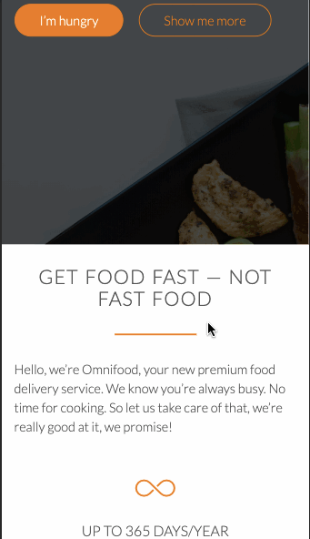

# Objective
This project focuses on the basic skills of web development using HTML and CSS. These tools were used to create a better display of the webpage, to make the webdesing more appealing. The site is also responsive as it includes various responses to certain buttons, icons, etc. It also has the an option to view the website in either a desktp or a mobile device, to whatever the user prefers. This was the outcome of the project known as Omnifood designed by Jonas Schmedtmann.

# Omnifood
Omnifood is a fictional food delivery company, that provides food delivery services that serve whatever the customer feels like eating such as pizza, ramen, steak, burgers, soup, dessert, and many more delishes orders. The purposes of the website is to practice the main properties of HTML and CSS, including showcases, features and footers as well as responsive layout. It also includes a responsive layout that uses JavaScrpit, and it also comes with a widescreen and smartphone view.

# <h4>Omnifood Widescreen Tour:</h4>

# <h4>Omnifood Smartphone Tour:</h4>

